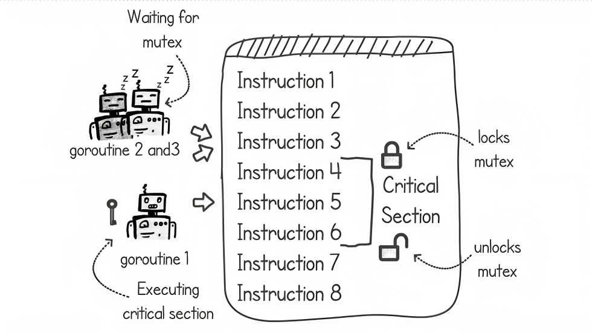
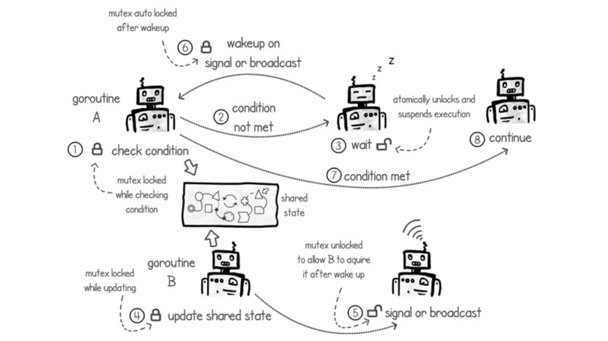
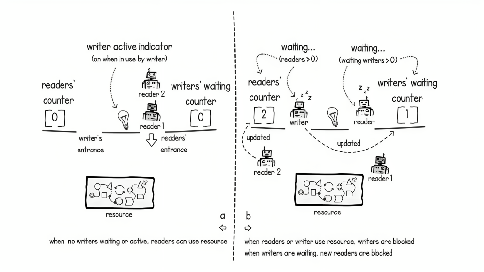
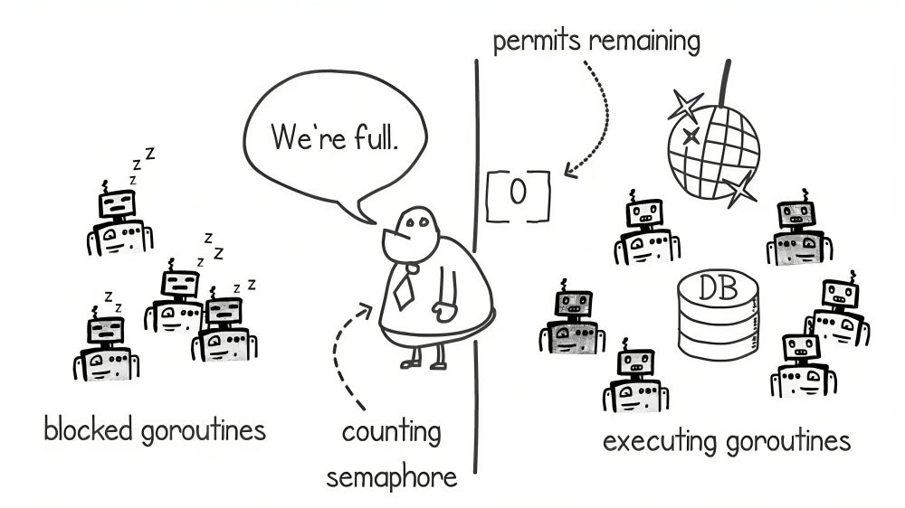
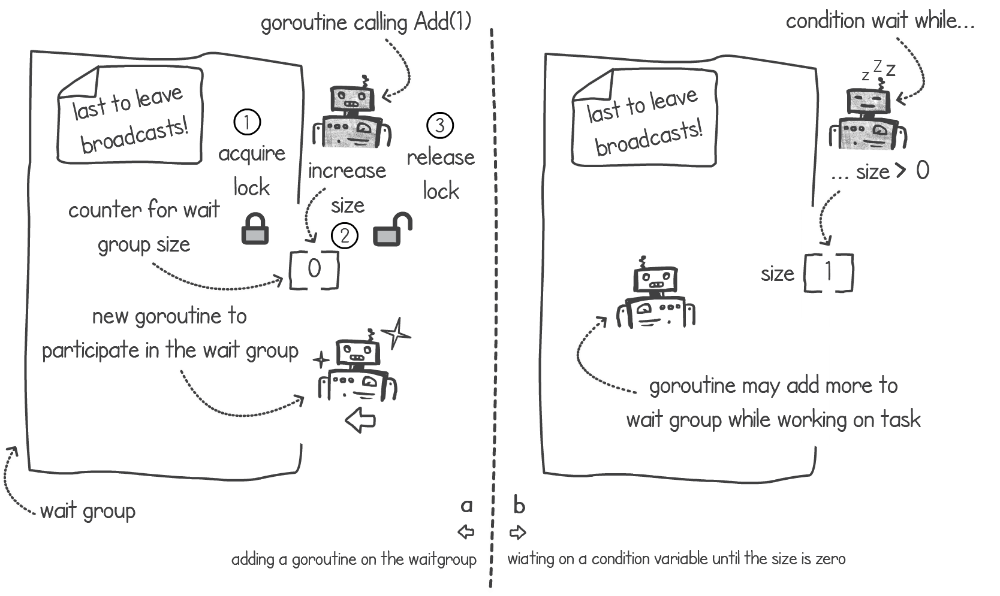
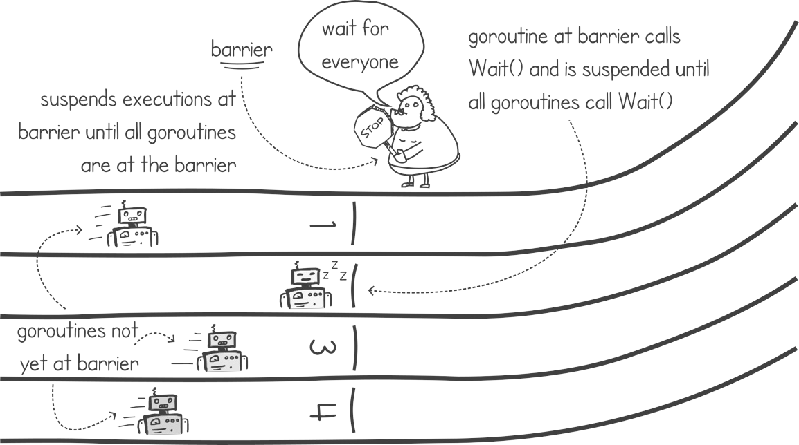

# Concurrent Programming in Go
This repository holds codes of concurrent programming tools like mutexs, semaphores, wait groups, etc.

## Mutexes
**Mutexes** is short for *mutual exclusion*.
Mutexes make access to shared memory synchronous while modifying them. Thus blocking concurrency when modifying the shared resources and preventing race conditions. 

## Conditional Variable
**Condition variables** work together with mutexes and give us the ability to block the current execution until we have a signal that a particular condition has changed.

## Read-Write Mutex
Because of greedy executions, the shared resource may be made unavailable for a long time, which prevents write execution from gaining access to a shared resource.
This issue can be solved by using a **Read-Write Mutex** with write-preferred lock.

## Semaphore
**Semaphore** let us control the number of concurrent execution that are permitted to execute at the same time.

## Wait Group
**Wait Groups** can make a goroutine wait for a set of concurrent task to complete.

## Barrier
**Barrier** is a type of syncronization method that is used to make a group of goroutines execute some code at the same time.

